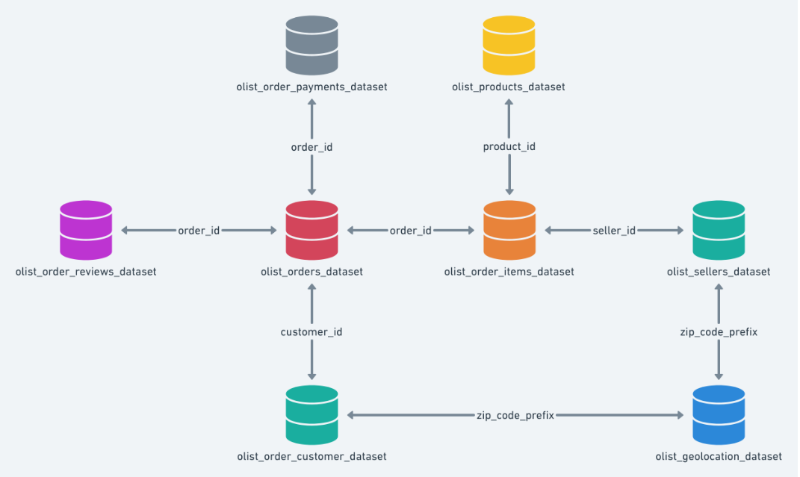
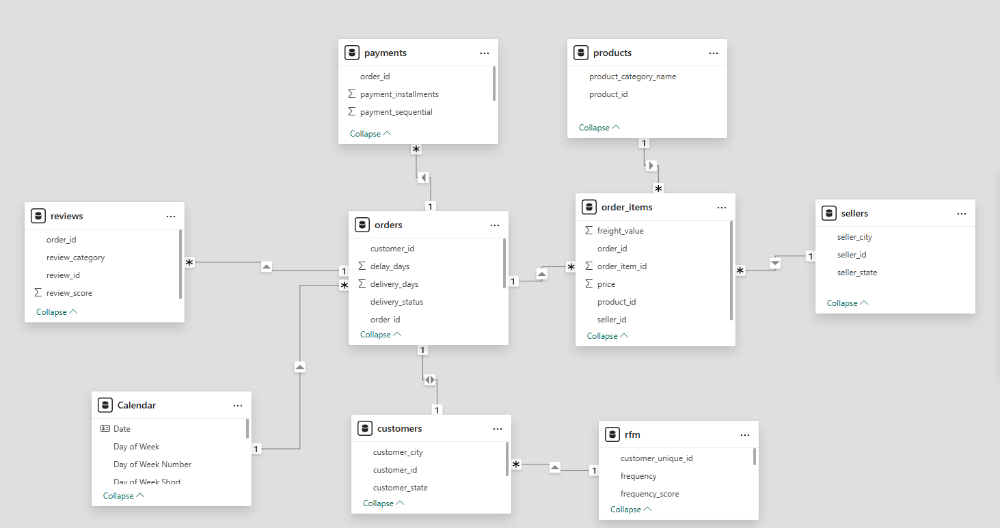
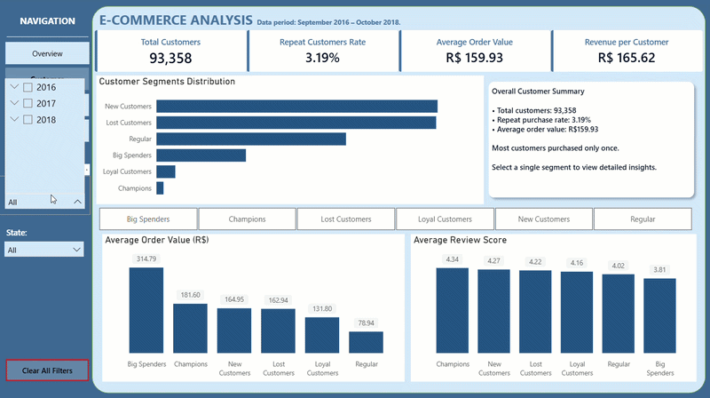
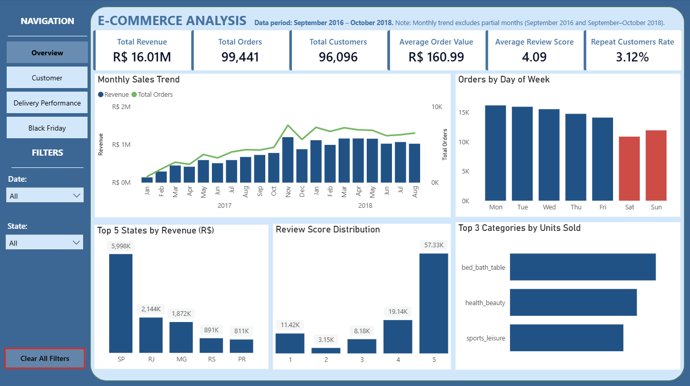
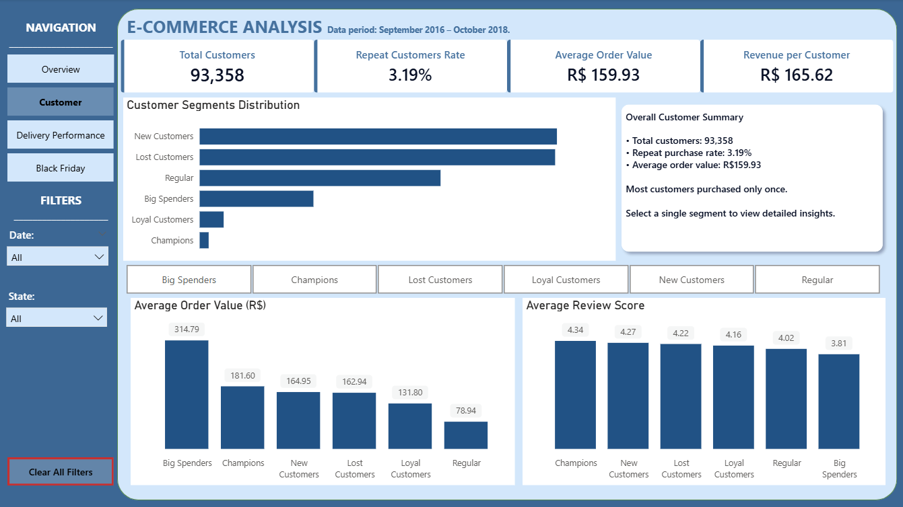
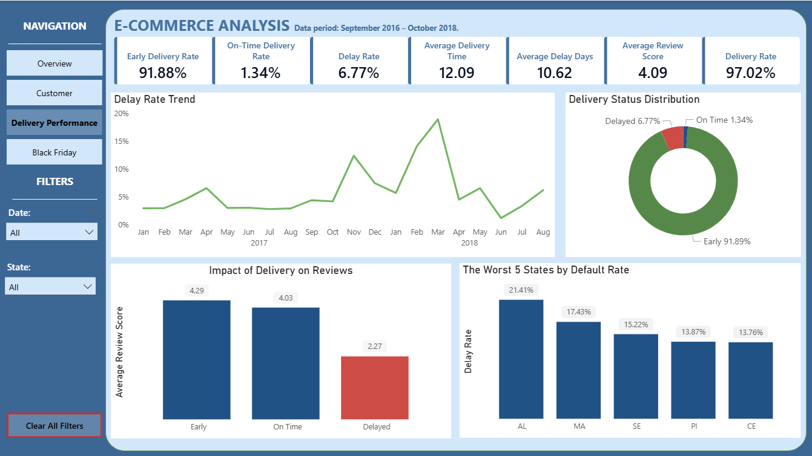
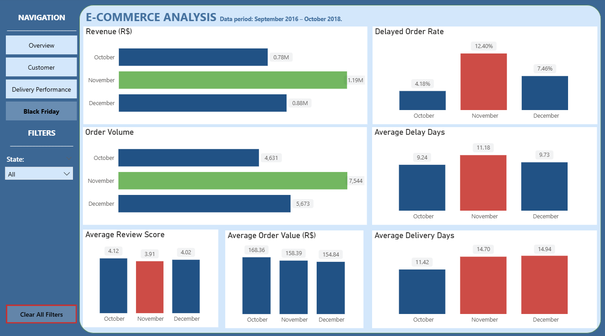

# Brazilian E-commerce Sales Analysis
## Table of Contents

- [Project Overview](#project-overview)
- [Dataset](#dataset)
- [Dashboard Pages](#dashboard)
- [Tools & Technologies](#tools--technologies)
- [Methodology](#methodology)
- [Key Insights](#key-insights)
- [Business Recommendations](#business-recommendations)
- [How to Run](#how-to-run)
  
## Project overview
This project demonstrates an end-to-end analysis of the Brazilian Olist e-commerce dataset, covering the period from September 2016 to october 2018.

Monthly trend visualizations exclude incomplete months to avoid misleading trends.

**The goal of the analysis was to:**

- Analyze revenue trends and seasonality.
- Understand customer purchasing behavior.
- Analyze customer retention.
- Assess the impact of the Black Friday campaign on sales performance.
- Identify states with the greatest potential for sales improvement.
- Evaluate delivery performance and its impact on customer satisfaction.
- Provide data-driven business recommendations.
  
## Dataset

The dataset was sourced from [Kaggle](https://www.kaggle.com/datasets/olistbr/brazilian-ecommerce/code).
The dataset was imported into Python, cleand and transformed and then loaded into a PostgreSQL database for further analysis.
Due to file size limitations, the raw dataset is not included in this repository.

### Data Model

## Dashboard 
Dashboard is fully interacted and allow users to explore sales, customer behaviour, delivery performance and Black Friday trends through filters. 

 ### Dashboard Pages

[View dashboard PDF](Ecommerce_dashboard.pdf)

## Tools & Technologies:
- Python (Pandas, NumPy, Matplotlib)
- Jupyter Notebook
- SQL (PostgreSQL)
- Power BI 
- DAX
- Data Modeling

## Methodology

### Python
Python was used to:
- Import the dataset
- Clean and preprocess the data
- Handle missing values
- Remove duplicates
- Correct data types
- Perform feature engineering
- Conduct RFM analysis
- Conduct cohort analysis
- Export cleaned data to PostgreSQL

View [Jupyter Notebook](python/ecommerce_analysis.ipynb)

The cleaned data was stored in PostgreSQL, where additional business analyses were performed using SQL.

 ### SQL
PostgreSQl was used to perform:
- Sales Performance Analysis ([View queries](sql_analysis/Sales_performance_queries.sql))
- Product Analysis ([View queries](sql_analysis/Product_analysis_queries.sql))
- Delivery Performance Analysis ([View queries](sql_analysis/Delivery_performance_queries.sql))
- Seller Analysis ([View queries](sql_analysis/Seller_analysis_queries.sql))
- Customer Behaviour Analysis (using customer segments from RFM analysis) ([View queries](sql_analysis/Rfm_analysis_queries.sql))
- Black Friday Analysis ([View queries](sql_analysis/Black_friday_analysis_queries.sql))

SQL Analysis utilized:
- JOINS
- CTE
- Window Functions
- Views

### Power BI
Power BI was used to:
- Present analytical results through interactive dashboards.
- Create KPIs using DAX measures.

View [DAX Measures](powerbi/DAX_measures.txt)

  ## Key Insights

- **Total revenue reached R$16.01M** across **99,441 orders** placed by **96,096 unique customers**, with an average order value of **R$161**.
- **Approximately 97% of customers made only one purchase**, resulting in a repeat purchase rate of just **3.12%**. This indicates that customer retention is the greatest opportunity for long-term revenue growth.
- **New Customers** and **Lost Customers** are the two largest RFM segments, highlighting high customer acquisition but low customer retention.
- **Big Spenders** have the highest average order value (**R$314.79**), although they represent only a small share of the customer base.
- **Sales volume is consistently lower on weekends**, with Saturday recording the lowest number of orders.
- **Revenue** and **order volume** peaked in November during the Black Friday season. Compared with October, revenue increased by 52.6% (from R$0.78M to R$1.19M), while order volume grew by 62.9% (from 4,631 to 7,544 orders), demonstrating the significant impact of the   Black Friday campaign.n.
- During the Black Friday period, **average delivery time increased from 11.42 days in October to 14.70 days in November**, while the **delay rate rose from 4.18% to 12.40%**.
- Longer delivery times negatively affected customer satisfaction. **Delayed orders received an average review score of 2.27**, compared with **4.03** for on-time deliveries and **4.29** for early deliveries.
- **91.88% of delivered orders arrived before the estimated delivery date**, while only **1.34%** arrived exactly on time and **6.77%** were delayed.

- ## Business Recommendations

- Develop targeted marketing campaigns tailored to each **RFM customer segment**:
  - **Big Spenders:** Encourage more frequent purchases through personalized offers, exclusive discounts, or loyalty rewards to maximize revenue.
  - **Loyal Customers:** Maintain engagement by rewarding customer loyalty and providing personalized recommendations.
  - **Regular Customers:** Increase purchase frequency through targeted promotions and personalized product recommendations.
  - **New Customers:** Focus on converting first-time buyers into repeat customers through welcome offers, follow-up emails, and loyalty programs, as this segment represents the greatest opportunity for long-term revenue growth.
  - **Lost Customers:** Launch re-engagement campaigns using personalized discounts or promotional offers to encourage customers to return.
- Consider targeted weekend campaigns to increase weekend sales performance.
- Investigate the reasons behind the lower sales performance in underperforming states and expand successful practices from top-performing regions where possible.
- Improve logistics in states with the highest delay rates and longest delivery times to reduce delays and increase customer satisfaction.
- Continue monitoring delivery performance, as delayed deliveries have a significant negative impact on customer review scores and overall customer experience.

## How to run

pip install -r requirements.txt
